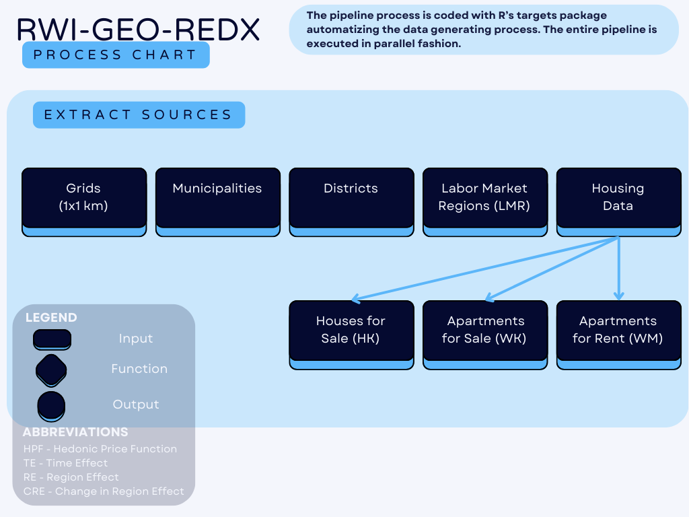
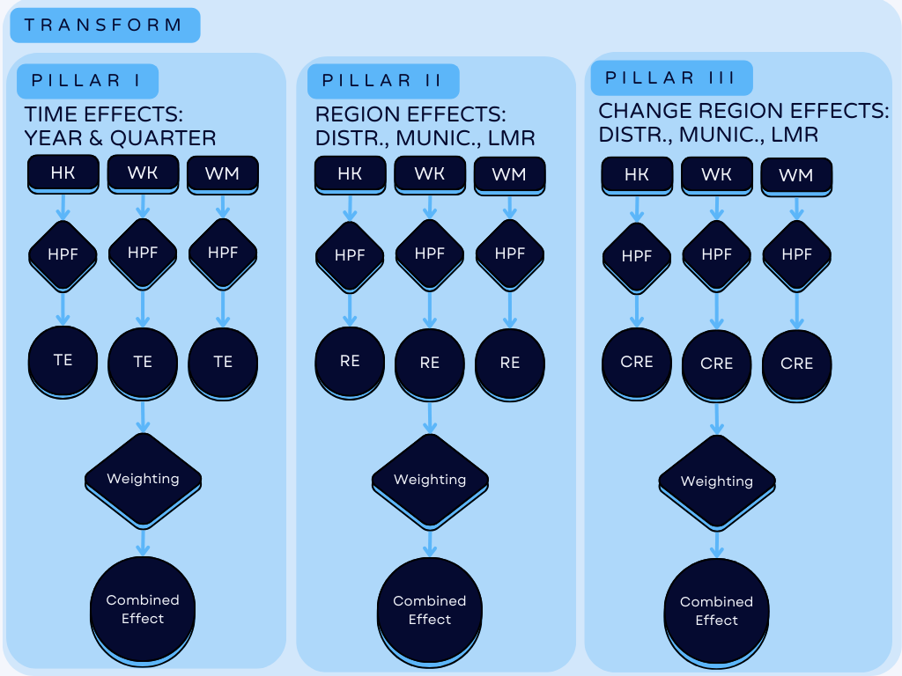
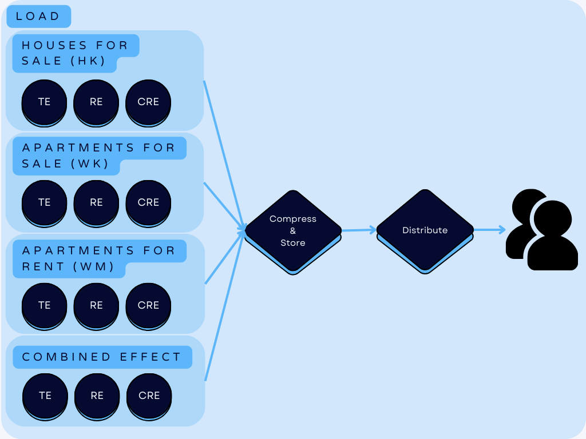

# RWI-GEO-REDX: A Housing Price Index for Germany

This repository shows the detailed preparation and generation of RWI-GEO-REDX price index.

## Abstract Data Description (v14)

The FDZ Ruhr at RWI offers price indices for apartments and houses (rentals and sales) in Germany, commencing in 2008. The price indices are derived from the RWI-GEO-RED real estate dataset, which integrates real estate listings from ImmoScout24. Three types of hedonic regressions are performed to allow for comparisons across time (annual or quarterly), across regions (1 x 1 km, municipality, district, and labor market region), and in combination across time and regions. Furthermore, starting with V13, we also offer a combined index, whereby all three data sources (apartment rents and sales, and house sales) are combined into a single index. The data are publicly available (PUF) and can be requested from the FDZ Ruhr website. A weakly anonymized version (SUF) is also available for researchers upon request.

This data report constitutes an updated version of previous reports and refers to RWI-GEO-REDX v14, which encompasses data up to May 2024.

## Access

The data can be obtained as a Public Use File (PUF) or a Scientific Use File (SUF) from the FDZ Ruhr at RWI. The FDZ Ruhr is the research data center of the RWI - Leibniz Institute for Economic Research. In order to ensure that the indices are not driven by small sample sizes, the PUF dataset includes only those indices that are based on at least 50 observations per year and region. The indices based on less than 50 observations per year and region are also available on request as an SUF for scientific research purposes only. It is up to the researcher to decide whether this lower threshold is reliable in the considered research design. Since the RWI-GEO-REDX subsumes aggregated information, it does not contain any information that is restricted for data security reasons. The indices presented here are available as Excel (.xlsx) files.

Data access does not require a data use agreement, but users must register to access the data. Interested users should visit our website https://www.rwi-essen.de/en/research-advice/further/research-data-center-ruhr-fdz/data-access.

It is not permitted for users to undertake any action that might result in the re-identification of individual homes or apartments.

Users are requested to cite the source correctly and to inform the FDZ Ruhr about publications using the data. When using the dataset RWI-GEO-REDX, please cite the data as RWI (2024): RWI-GEO-REDX: Regional Real Estate Price Index for Germany, 2008-11/2023 (V14). Version: 1. RWI – Leibniz Institute for Economic Research. Dataset. http://doi.org/10.7807/immo:redx:puf:v14. Further, we recommend citing this data description.

## Data generating process

The data generation process follows a classic ETL pipeline setup, where first the sources (mainly geographic information and housing data) are extracted and cleaned. Then, in the transformation step, three estimations are performed (represented by the three pillars in the figure below). Finally, the data is loaded into the final dataset and distributed to users on demand.

For more details, especially on the estimates, please refer to the [data report](https://www.rwi-essen.de/fileadmin/user_upload/RWI/FDZ/Datenbeschreibung-REDX-v13.pdf).

     

     

     

<h6 style="text-align: center;"><strong>Data Generating Process for the dataset RWI-GEO-REDX. Source: Patrick Thiel.</strong></h6>

## More Information

- [General information on RWI-GEO-RED/X](https://www.rwi-essen.de/en/research-advice/further/research-data-center-ruhr-fdz/data-sets/rwi-geo-red/x-real-estate-data-and-price-indices)
- [Data report RWI-GEO-REDX v14](https://www.rwi-essen.de/fileadmin/user_upload/RWI/FDZ/Datenbeschreibung-REDX-v14.pdf). Please cite the data report as: Thiel (2024), FDZ Data Description: Regional Real Estate Price Index for Germany, 2008-05/2024 (V14), RWI Projektberichte, Essen

## DOI
- Repository for V14.0: 
- RWI-GEO-REDX V14 (PUF): http://doi.org/10.7807/immo:redx:puf:v14
- RWI-GEO-REDX V14 (SUF): http://doi.org/10.7807/immo:redx:suf:v14

## Contact Person

Please contact [Dr. Patrick Thiel](https://www.rwi-essen.de/rwi/team/person/patrick-thiel) in case of questions.

## Disclaimer

All rights reserved to RWI and the author of the code, [Dr. Patrick Thiel](https://www.rwi-essen.de/rwi/team/person/patrick-thiel).
